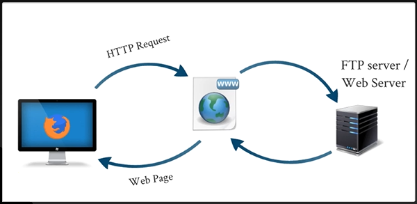

# وب

## فهرست

* [برنامه نویسی چیست؟](#برنامه-نویسی-چیه)
* [حوزه‌های برنامه نویسی](#حوزههای-برنامه-نویسی)
* [چرا وب؟](#چرا-وب)
* [بخش‌های مختلف طراحی سایت](#بخشهای-مختلف-طراحی-سایت)
* [تکنولوژی طراحی وب](#تکنولوژی-طراحی-وب)
* [تکنولوژی برنامه نویسی وب](#تکنولوژی-برنامه-نویسی-وب)
* [نکات ضروری برای رسیدن به نتیجه مطلوب](#نکات-ضروری-برای-رسیدن-به-نتیجه-مطلوب)
* [سرور](#سرور)

## برنامه نویسی چیه؟ 

برنامه نویسی زبان صحبت کردن با ماشین (کامپیوتر:computer:، برد الکتریکی، ربات و...) است.

هر ماشین، زبان مخصوص به خودش دارد.

:pushpin:برای صحبت با مردم چین باید چینی صحبت کرد.

## حوزه‌های برنامه نویسی

1. وب:computer:
2. موبایل:iphone:
3. دسکتاپ:desktop_computer:
4. هوش مصنوعی:brain:
5. هک و امنیت:closed_lock_with_key:
6. علوم داده و دیتاساینس:floppy_disk:
7. و...

## چرا وب؟

1. به نسبت راحت تر است.
2. روند صعودی است.:arrow_up: (یعنی از آسان شروع می شود و حرفه‌ای می شود)
3. ابزار:hammer_and_wrench: خاصی نیاز ندارد.
4. همه می توانند این زمینه را شروع کنند. (محدود به سن، جنسیت:couple:، سواد و دانش:pencil2: و... نیست.)
5. اینترنت همه جا داریم؛ پس صفحات وب لازم است.
6. دانش:open_book: در این زمینه تو بقیه زمینه‌ها کاربرد دارد.
7. حوزه‌های زیادی دارد که متناسب با سیلقه‌های مختلف افراد:man_technologist: است.

## بخش‌های مختلف طراحی سایت

- طراحی وب 
(Front-End) 
(Client Side) 
چیزی که کاربر داخل مرورگر می بیند:eyes: را می نویسد. 
مناسب کسایی که دیزاین:paintbrush: دوست دارند:sparkling_heart:.
- برنامه نویسی وب 
(Back-End) 
(Server Side) 
کد ها و منطق:brain: پس زمینه صفحات وب را می نویسد. 
مناسب کسایی که ریاضی:heavy_plus_sign: و منطق دوست دارند:two_hearts:.

## تکنولوژی طراحی وب

HTML, CSS, JavaScript,…

:pushpin:اشتباه رایج» HTML & CSS زبان برنامه نویسی نیستند.

* آخرین نسخه HTML5 ،HTML است.
* آخرین نسخه CSS3 ،CSS است.

## تکنولوژی برنامه نویسی وب

PHP, ASP.net, Python,…

## موراد لازم برای شروع یادگیری

به سیستم خاصی یا قوی برای شروع لازم نیست.

:no_entry:نه هوش بالا، نه ریاضی قوی، نه مدرک خواص و نه ... می خواهید.

:bangbang:<strong>فقققققققط</strong> تمرین

:heavy_check_mark:پس بعد از دیدن هر فیلم، <strong>حتما</strong> تمرین کنید تا کامل یاد بگیرید.

:warning:دنبال نتیجه آنی نباشد؛ چون نتیجه هر چه قدر زودتر بدست بیایید، کوتاه مدت‌تر است.

## نکات ضروری برای رسیدن به نتیجه مطلوب

1. شل کن و سفت کن فایده ندارد:exclamation:، باید مستمر تلاش کنید.
2. با تمرکز کار کنید و آموزش ببینید:eyes:.
3. نوت برداری:pencil: کنید، مطالب فرار است.
4. برا خودتان زمان:alarm_clock: مشخص کنید و متعهد:handshake: باشید.
5. فیلم‌های آموزشی، فیلم سینمایی:clapper: نیست.
6. تمرین:keyboard: یادتان نرود.
7. همین طوری جلو:walking: نرید، باید کامل فیلم یاد بگیرید تا برید سراغ فیلم بعدی.
8. تمرین:computer_mouse: باید حین فیلم یا حداکثر بلافاصله بعد از تمام شدن فیلم باشد.
9. فیلم ها را آن قدر نگاه:eye: کنید تا یاد بگیرید.
10. از ندانستن نترسید، پیش برید تا ابهامات:interrobang: براتان برطرف شود.

## سرور

کامپیوتر:computer: خیلی قوی که ممکن است هرجایی باشد ولی همیشه به نت وصل است.

وقتی می خواهیم صفحه وبی را نگاه کنیم، درخواست خودمان را به سرور می‌فرستیم و سرور صفحه را برای ما نشان می دهد.

به جایی:house: که سرورها قرار می گیرند اتاق سرور (server room) می گویند.

:pushpin:WWWW: World Wide Web

